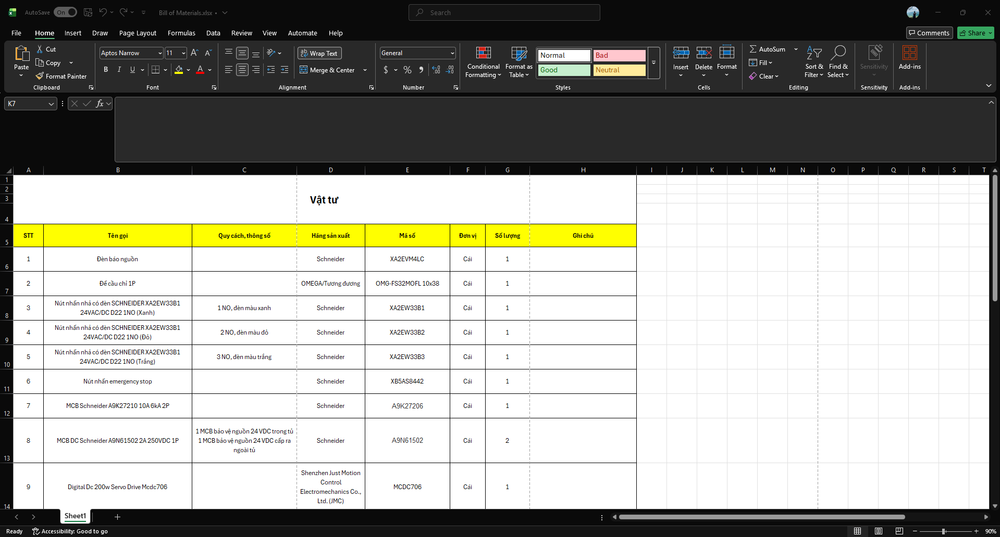
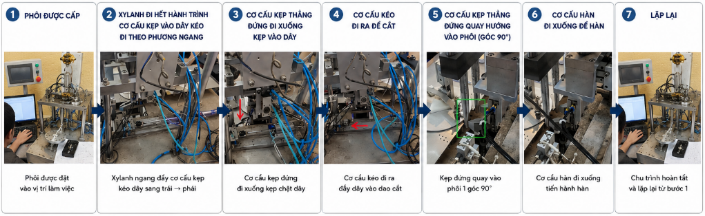
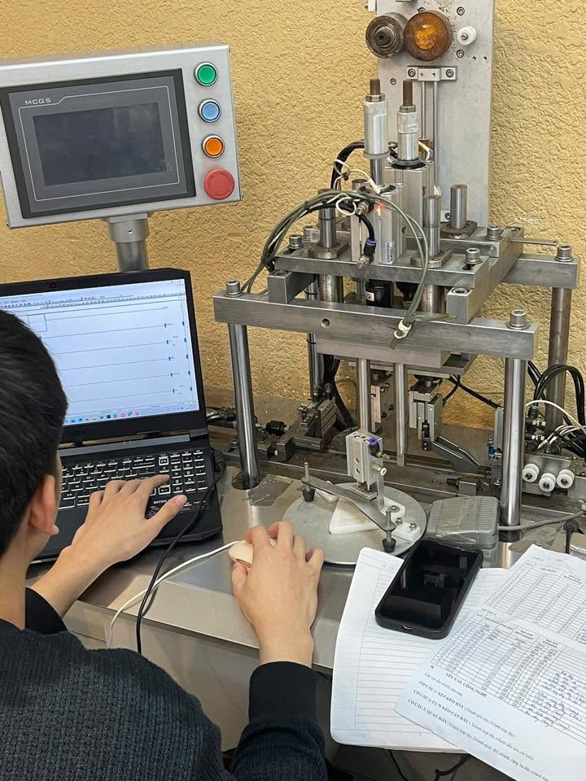
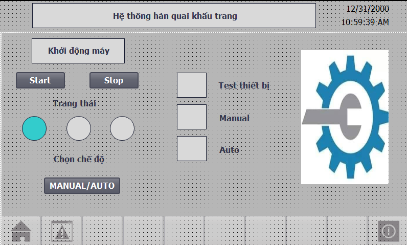
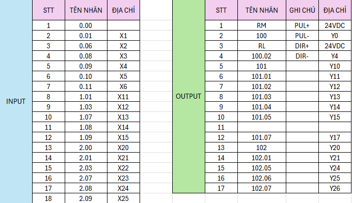

# PLC - Automatic Face Mask Making Machine

## 📌 Introduction

Developed an automatic face mask manufacturing machine using PLC control.

The system is capable of controlling:
- Material feeding
- Ultrasonic/heat sealing process
- Automatic cutting
- Finished product collection

## ⚙️ System Components

- PLC: Mitsubishi FX3U
- HMI: HMI MCGS HMI TPC7062TD
- Sensors: Photoelectric sensors, proximity sensors
- Actuators:
  - Servo motor
  - Pneumatic cylinders
  - Pneumatic clamp mechanism
  - Pneumatic cutting mechanism

## 🔧 Main Functions

- Automatic production sequence control
- Sensor feedback processing
- Motor and actuator control
- Error detection and safety handling

## 🎥  [ System Operation Video ]

  

## 🔧 Bill of Materials 

  

## 🛠️ Electrical cabinet drawing

  

## 🛠️ Power Supply Diagram

  

## 🛠️ PLC  Diagram

  

## 🛠️ Driver Servo Diagram

  

## 🏗️ System Architecture

## 📷 Project Images

## 🛠️ HMI

## 🛠️ INPUT and OUTPUT

## 🛠️ Technologies

| Category | Tools |
|---|---|
| PLC Programming | TIA Portal |
| Automation | Siemens S7-1200 |
| HMI Design | WinCC |
| Control System | PLC Ladder Logic |
